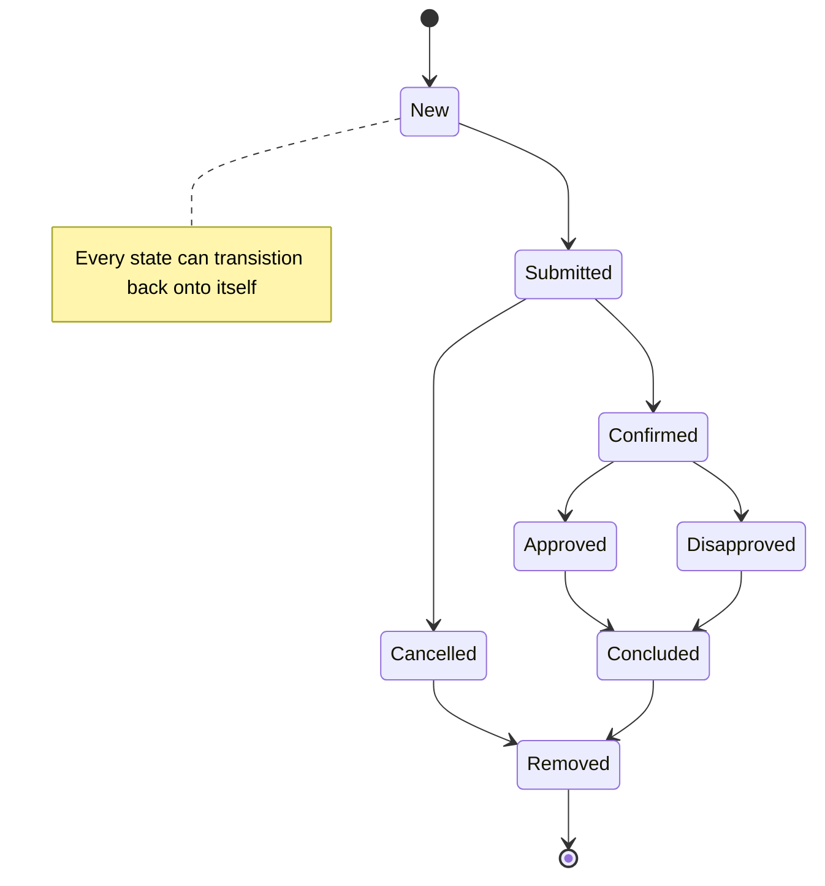
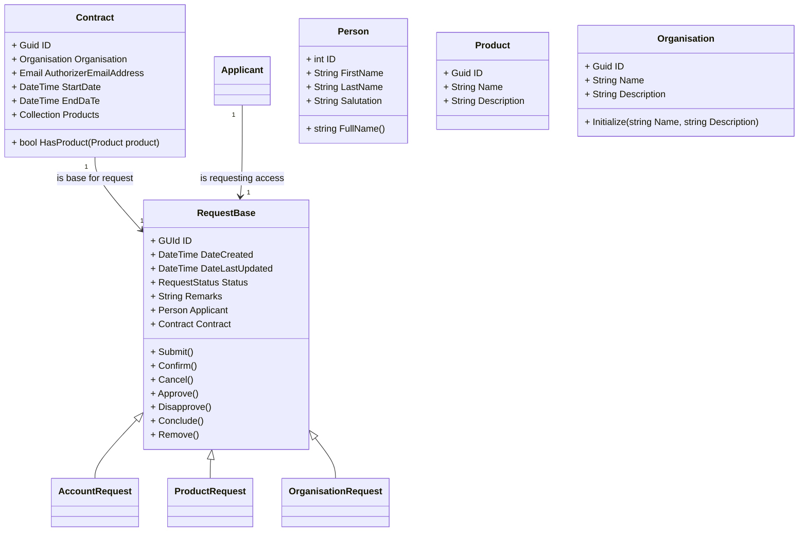

***
## Legenda

term| definition or values
|:---|:---|
|root|api/authorisations  
|type|account, organisation, product   
|id|GUID  
|Q|Query  
|C|Command
|verb| GET, POST, PUT, PATCH, DELETE, HEAD, OPTIONS, CONNECT, TRACE  |
</br>  
  
  ***  

## Idempotency

> A request method is considered "idempotent" if the intended effect on the server of multiple identical requests with that method is the same as the effect for a single such request

</br>  

*** 
## API definition

|done|style|CQ|path | verb | success | Error | description|
|:---:|:---:|:---:|:---|:---:|:---:|:---:|---|
|<span style="color:green">Yes</span>|REST|Q|root|GET| 200 | 404| returns { status: "up" }|
|<span style="color:green">Yes</span>|REST|Q|root/request/{id}/status |GET| 200|404| returns current status of request with {id}|
|<span style="color:red">No</span>|RPC|Q|root/request/{id}/{status} |GET|200|404| returns true if status of request with {id} is {status}
|<span style="color:green">Yes</span>|REST|Q|root/requests/under-consideration/count |GET| 200|404| return total number of requests being processed
|<span style="color:green">Yes</span>|REST|Q|root/requests/under-consideration/{type}/count |GET| 200 |404 | return total number of account requests of {type }being processed
|<span style="color:green">Yes</span>|REST|Q|root/requests/{status} |GET| 200|404| returns ID of all requests with status = {status}
|<span style="color:red">No</span>|REST|Q|root/requests/{status}/{type} |GET| 200|404| returns ID of all requests of {type} with status = {status}}
|<span style="color:red">No</span>|REST|Q|root/request/{id}|GET| 200|404| returns current request info wher  ID = {id}
|<span style="color:red">No</span>|REST|C|root/request/submit/{type}|POST| 202|404,405| submit request where type is in {account, product, organisation}
|<span style="color:red">No</span>|REST|C|root/request/{id}/confirm|POST| 202|404,405| confirm request where id = {id} 
|<span style="color:red">No</span>|REST|C|root/request/{id}/cancel|POST| 202|404,405| cancel request where id = {id} 
|<span style="color:red">No</span>|REST|C|root/request/{id}/approve|POST| 202|404,405| approve request where id = {id} 
|<span style="color:red">No</span>|REST|C|root/request/{id}/disapprove|POST| 202|404,405| disapprove request where id = {id} 
|<span style="color:red">No</span>|REST|C|root/request/{id}/conclude|POST| 202|404,405| conclude request where id = {id} 
|<span style="color:red">No</span>|REST|C|root/request/{id}/remove|DELETE| 204|404,405| remove request where id = {id} 

<br>  


***
# Valid transitions

 |Command: |new|submit|Confirm|Cancel|Approve|Disapprove|Conclude|Remove|
 |:---:|:---:|:---:|:---:|:---:|:---:|:---:|:---:|:---:|
 |State |||||||||
|New|<span style="color:yellow">Yes</span>|<span style="color:green">Yes</span>|<span style="color:red">No</span>|<span style="color:red">No</span>|<span style="color:red">No</span>|<span style="color:red">No</span>|<span style="color:red">No</span>|<span style="color:green">Yes</span>
|Submitted|<span style="color:red">No</span>|<span style="color:yellow">Yes</span>|<span style="color:green">Yes</span>|<span style="color:green">Yes</span>|<span style="color:red">No</span>|<span style="color:red">No</span>|<span style="color:red">No</span>|<span style="color:red">No</span>
|Confirmed|<span style="color:red">No</span>|<span style="color:red">No</span>|<span style="color:yellow">Yes</span>|<span style="color:red">No</span>|<span style="color:green">Yes</span>|<span style="color:green">Yes</span>|<span style="color:red">No</span>|<span style="color:red">No</span>
|Cancelled|<span style="color:red">No</span>|<span style="color:red">No</span>|<span style="color:red">No</span>|<span style="color:yellow">Yes</span>|<span style="color:red">No</span>|<span style="color:red">No</span>|<span style="color:green">Yes</span>|<span style="color:red">No</span>
|Approved|<span style="color:red">No</span>|<span style="color:red">No</span>|<span style="color:red">No</span>|<span style="color:red">No</span>|<span style="color:yellow">Yes</span>|<span style="color:red">No</span>|<span style="color:green">Yes</span>|<span style="color:red">No</span>
|Disapproved|<span style="color:red">No</span>|<span style="color:red">No</span>|<span style="color:red">No</span>|<span style="color:red">No</span>|<span style="color:red">No</span>|<span style="color:yellow">Yes</span>|<span style="color:green">Yes</span>|<span style="color:red">No</span>
|Concluded|<span style="color:red">No</span>|<span style="color:red">No</span>|<span style="color:red">No</span>|<span style="color:red">No</span>|<span style="color:red">No</span>|<span style="color:red">No</span>|<span style="color:yellow">Yes</span>|<span style="color:green">Yes</span>
|Removed|<span style="color:red">No</span>|<span style="color:red">No</span>|<span style="color:red">No</span>|<span style="color:red">No</span>|<span style="color:red">No</span>|<span style="color:red">No</span>|<span style="color:red">No</span>|<span style="color:yellow">Yes</span>

***
# Query message examples


## General message when query is not succesful

```
  Answer:  
  {
    "Query" : "Ping"
    // other query entries
    "Failure" : "Text explaining why query  failed"
  }

  Possible values for  Query:  Invalid | Ping | CurrentStatus | HasStatus | UnderConsideration | WithStatus | Request | History              
```

## Ping Status

```
  Pinging the Server status Query: 
  { 
    "Query" : "Ping"  
  }

  Possible values:  Up  |  Down 

  Answer:  
  {
    "Query" : "Ping"
    "Webserver" :  "Up"
    "Broker": "Up"
    "RequestHandler": "Up"
    "Store" : "Up"
  }
```
## Querying for a specific request

 ```
  { 
    "Query" : "Request",
    "ID" : "2399f0c7-c359-4768-aaad-8b0aaf6b2537" 
  }

  Answer: 
  { 
    "Query" : "Request" , 
    "ID" : "2399f0c7-c359-4768-aaad-8b0aaf6b2537"
    "Request" : {
      "Applicant": {
          "FirstName": "Dong",
          "ID": 72781,
          "LastName": "Mcneese",
          "Salutation": "De Hr."
      },
      "Contract": {
          "AuthorizerMailAddress": "mad.deschank@gmail.com",
          "EndDate": "2022-12-22T13:40:41.9294609+01:00",
          "ID": "81e4e5d6-46c7-43de-a7f8-748ec7bccb75",
          "Organisation": {
              "Description": "Onvergetelijke thuiszorg",
              "ID": "89f35353-18d1-4ba6-a21e-223bbc8918e2",
              "Name": "Koning en Heuvel Zorgspecialisten"
          },
          "Products": [
              {
                  "Description": "Self service van mijn persoonlijjke AGB code",
                  "EndDate": "2023-12-22T00:00:00+01:00",
                  "ID": 105,
                  "Name": "MijnAGB",
                  "StartDate": "2020-12-21T00:00:00+01:00"
              },
              {
                  "Description": "Self service van mijn vektis account",
                  "EndDate": "2023-12-22T00:00:00+01:00",
                  "ID": 123,
                  "Name": "MijnVektis",
                  "StartDate": "2020-12-21T00:00:00+01:00"
              }
          ],
          "StartDate": "2020-12-20T13:40:41.929433+01:00"
      },
      "DateCreated": "2020-12-22T12:40:41.9305741Z",
      "DateLastUpdated": "2020-12-22T12:40:41.9846803Z",
      "ID": "2399f0c7-c359-4768-aaad-8b0aaf6b2537",
      "Remarks": "No remarks.",
      "Status": "Submitted",
      "Version": 2
    }
  }

 ```
## Querying for all requests with specific status

 ```
  { 
    "Query" : "WithStatus",
    "Status": "Submitted"  
  }

  Status  is  one  of:   New | Submitted | Confirmed | Cancelled | Approved | Rejected | Concluded | Removed

  Answer: 
  { 
    "Query" : "WithStatus" , 
    "Status": "Submitted"
    "ID" : "8341a4d4-6e04-466f-99c7-e04d48ee17e4" 
    "ID" : "6021cffe-5a50-4726-9656-fc30b13d0220"
    "ID" : "f9782b64-a7f5-46f1-84ec-d58e5e0de030"
  }

 ```
 ## Querying for requests of type with specific status

 ```
  { 
    "Query" : "WithStatus",
    "Type"  : "Account" 
    "Status": "Submitted"  
    "ID" : "8341a4d4-6e04-466f-99c7-e04d48ee17e4" 
    "ID" : "6021cffe-5a50-4726-9656-fc30b13d0220"
  }

  Type is one of: Account | Product | Organisation 
  Status is one of: New | Submitted | Confirmed | Cancelled | Approved | Rejected | Concluded | Removed

  Answer: 
  { 
    "Query" : "WithStatus" , 
    "Status": "Submitted"
    "ID" : "8341a4d4-6e04-466f-99c7-e04d48ee17e4" 
    "ID" : "6021cffe-5a50-4726-9656-fc30b13d0220"
    "ID" : "f9782b64-a7f5-46f1-84ec-d58e5e0de030"
  }
 ```
## Querying the number of requests under consideration

 ```
  { 
    "Query" : "UnderConsideratrion",
    "Type":   "Account"  
  }

  Type  is  one  of:    All | Account | Product | Organisation 

  Answer: 
  { 
    "Query" : "UnderConsideration" , 
    "Type":   "Account"
    "Count" : "23"
  }

 ```
## Querying the current status of a request

 ```
  { 
    "Query" : "CurrentStatus" , 
    "ID" : "8341a4d4-6e04-466f-99c7-e04d48ee17e4" 
  }

  Answer: 
  { 
    "Query" : "CurrentStatus" , 
    "ID" : "8341a4d4-6e04-466f-99c7-e04d48ee17e4" 
    "Status" : Submitted
  }
  
  ```
## Querying if a request has a specific status
 ```
  { 
    "Query" : "HasStatus" , 
    "ID" : "8341a4d4-6e04-466f-99c7-e04d48ee17e4", 
    "Status" : "Submitted"
  }

  Value is one  of:  true | false

  Answer: 
  { 
    "Query" : "HasStatus" , 
    "ID" : "8341a4d4-6e04-466f-99c7-e04d48ee17e4" 
    "Status" : Submitted
    "Result": "true"
  }

```

***
# State diagram of authorisation process
***




  